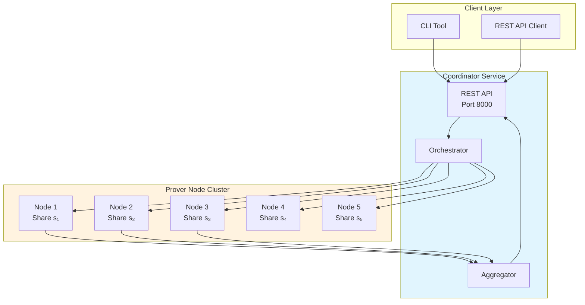
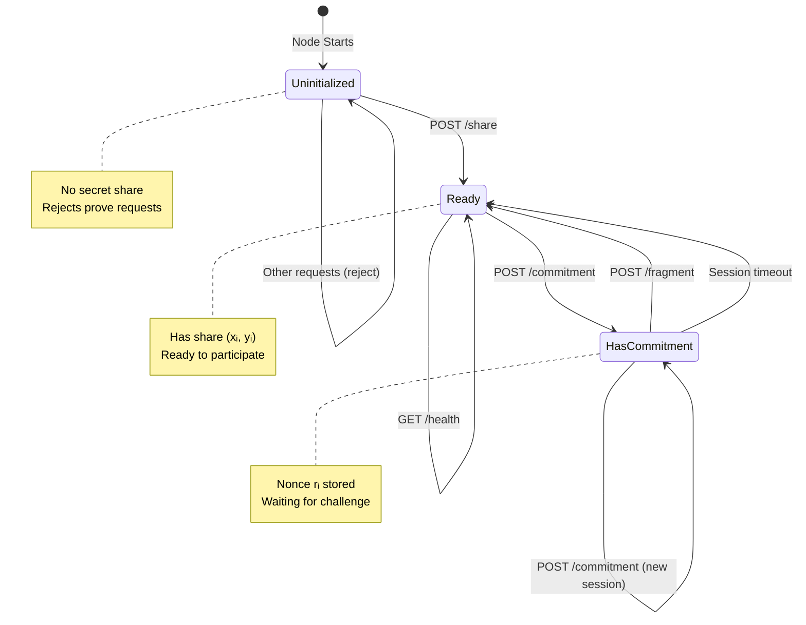
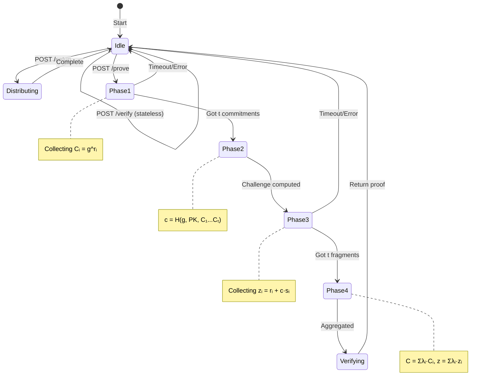
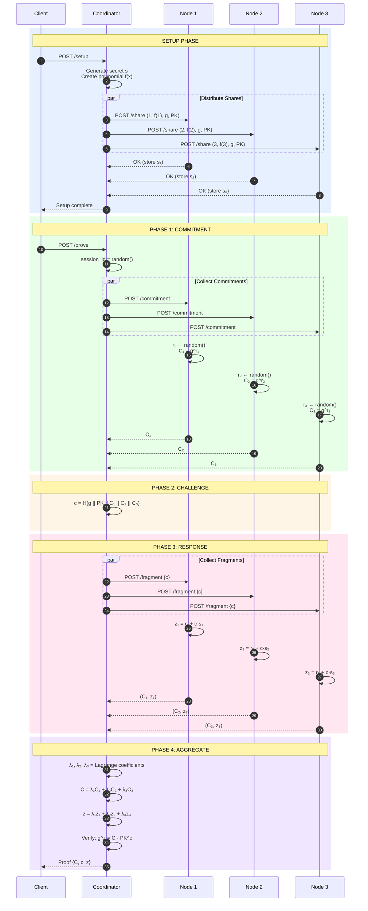
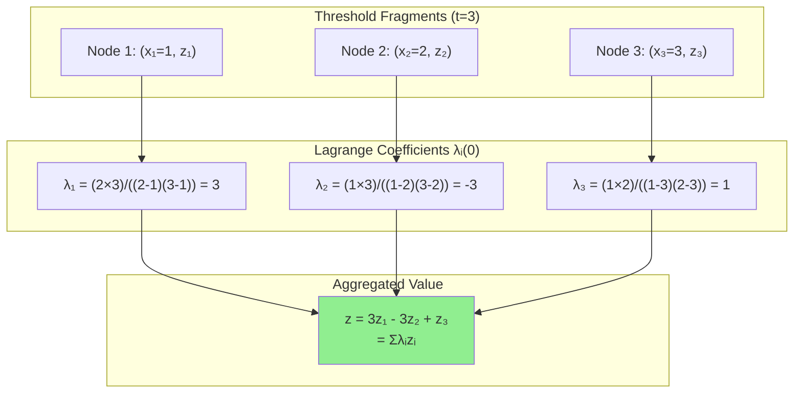
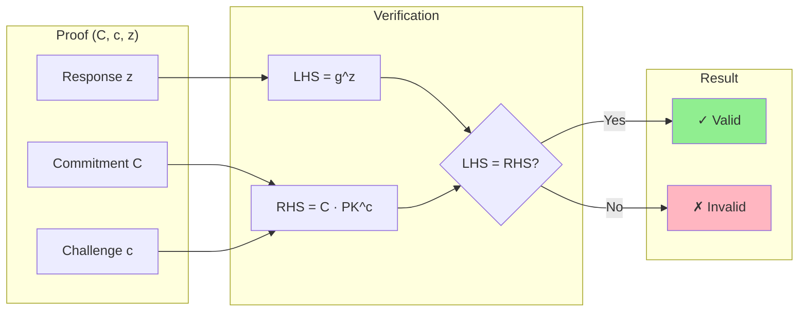
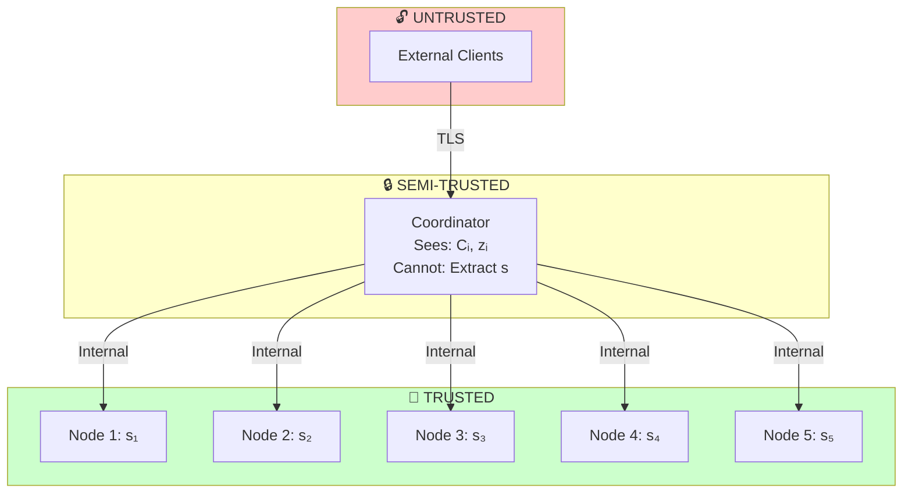
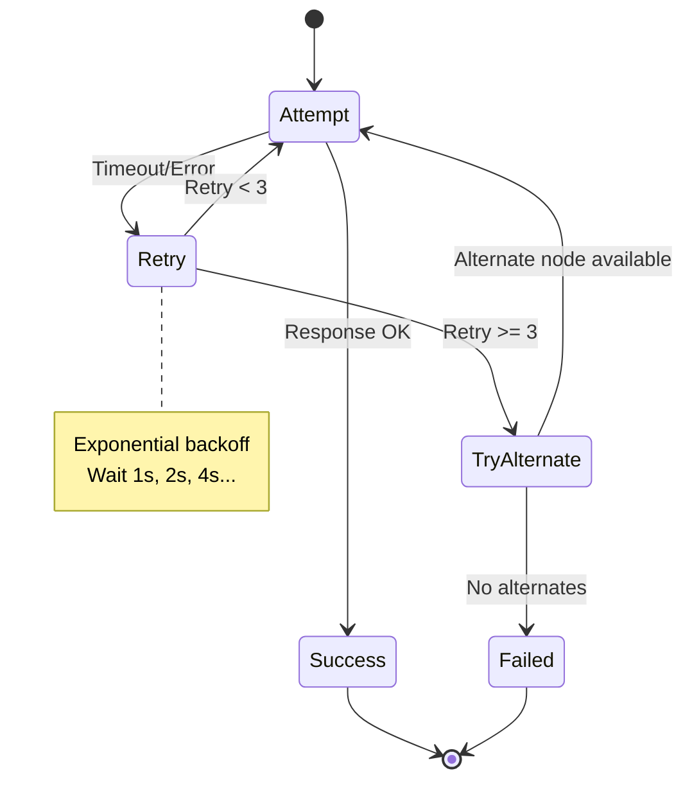

# State Machine Diagrams (Mermaid)

Copy these into https://mermaid.live to view interactive diagrams.

---

## 1. System Overview



---

## 2. Prover Node State Machine



---

## 3. Coordinator State Machine



---

## 4. Complete Protocol Sequence



---

## 5. Shamir Secret Sharing

```mermaid
flowchart LR
    subgraph Setup["Secret Sharing Setup"]
        S[Secret s] --> P[Polynomial<br/>f(x) = s + a₁x + a₂x²]
        P --> E1[f(1) = s₁]
        P --> E2[f(2) = s₂]
        P --> E3[f(3) = s₃]
        P --> E4[f(4) = s₄]
        P --> E5[f(5) = s₅]
    end

    subgraph Reconstruction["Reconstruction (any 3)"]
        R1[s₁] --> L[Lagrange<br/>Interpolation]
        R2[s₂] --> L
        R3[s₃] --> L
        L --> RS[s = f(0)]
    end

    E1 -.-> R1
    E2 -.-> R2
    E3 -.-> R3

    style S fill:#ffcccc
    style RS fill:#ccffcc
```

---

## 6. Lagrange Interpolation



---

## 7. Verification Equation



---

## 8. Security Boundaries



---

## 9. Error Handling State Machine



---

## 10. Data Flow

```mermaid
flowchart TB
    subgraph Setup["Setup Phase"]
        SECRET[Secret s] --> POLY[Polynomial f(x)]
        POLY --> SHARES[Shares s₁...sₙ]
        SECRET --> PK[Public Key g^s]
    end

    subgraph Commit["Commitment Phase"]
        NONCE[Nonces r₁...rₜ] --> COMMITS[Commitments C₁...Cₜ]
    end

    subgraph Challenge["Challenge Phase"]
        COMMITS --> HASH[SHA-256]
        PK --> HASH
        HASH --> CHAL[Challenge c]
    end

    subgraph Response["Response Phase"]
        NONCE --> RESP
        SHARES --> RESP
        CHAL --> RESP[Responses z₁...zₜ]
    end

    subgraph Aggregate["Aggregation"]
        COMMITS --> AGG
        RESP --> AGG[Lagrange Interpolation]
        AGG --> PROOF[Final Proof]
    end

    style SECRET fill:#ffcccc
    style PROOF fill:#ccffcc
```