# State Machine Diagrams

This document describes the state machines for all components in the distributed prover system.

## Table of Contents

1. [System Overview](#system-overview)
2. [Prover Node State Machine](#prover-node-state-machine)
3. [Coordinator State Machine](#coordinator-state-machine)
4. [Protocol Flow State Machine](#protocol-flow-state-machine)
5. [Session Lifecycle](#session-lifecycle)

---

## System Overview

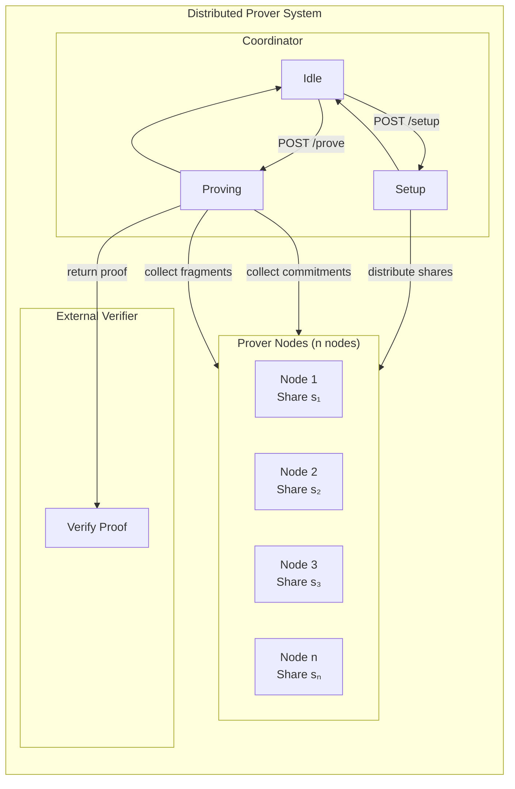

---

## Prover Node State Machine

Each prover node maintains its own state machine for handling requests.

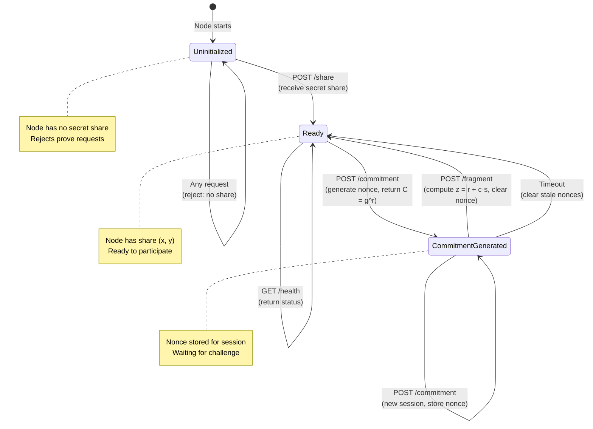

### Node State Details

| State | Description | Valid Operations |
|-------|-------------|------------------|
| `Uninitialized` | Node started but no share received | `GET /health`, `POST /share` |
| `Ready` | Has share, ready to participate | `GET /health`, `POST /commitment` |
| `CommitmentGenerated` | Nonce generated, waiting for challenge | `GET /health`, `POST /fragment`, `POST /commitment` (new session) |

### Node Transitions

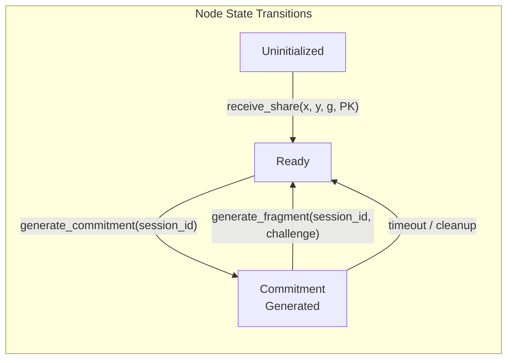

---

## Coordinator State Machine

The coordinator orchestrates the distributed proving protocol.

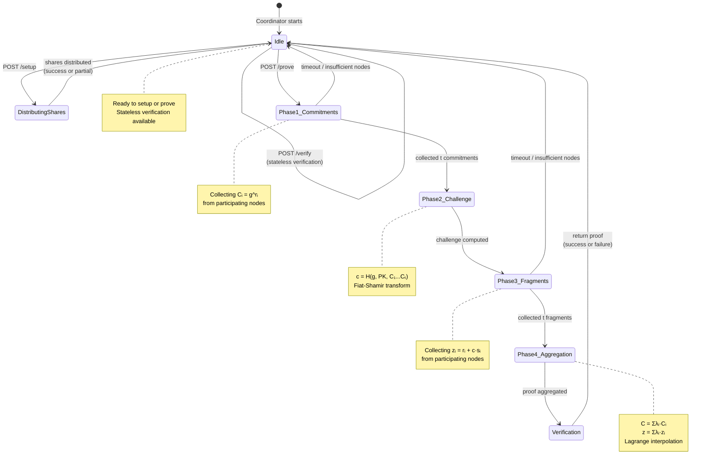

### Coordinator State Details

| State | Description | Next States |
|-------|-------------|-------------|
| `Idle` | Waiting for requests | `DistributingShares`, `Phase1_Commitments` |
| `DistributingShares` | Sending shares to nodes | `Idle` |
| `Phase1_Commitments` | Collecting commitments | `Phase2_Challenge`, `Idle` (error) |
| `Phase2_Challenge` | Computing challenge | `Phase3_Fragments` |
| `Phase3_Fragments` | Collecting responses | `Phase4_Aggregation`, `Idle` (error) |
| `Phase4_Aggregation` | Aggregating proof | `Verification` |
| `Verification` | Verifying final proof | `Idle` |

---

## Protocol Flow State Machine

The complete protocol flow showing interaction between coordinator and nodes.

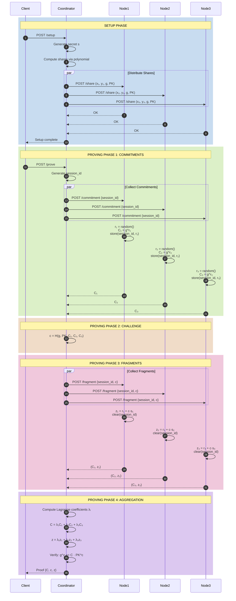

---

## Session Lifecycle

Each proving session has a defined lifecycle.

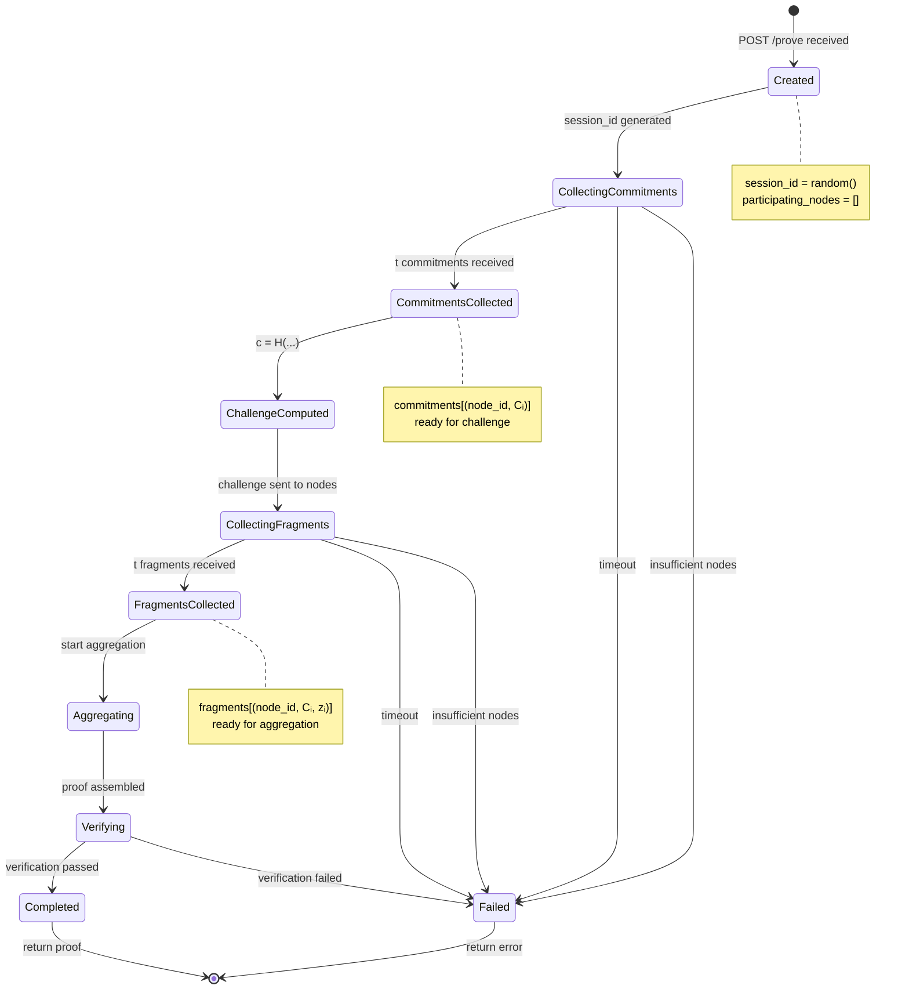

### Session Data Flow

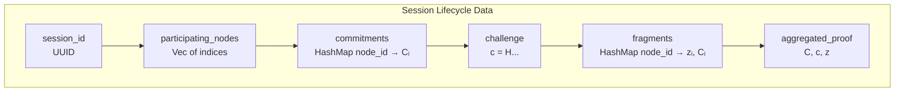

---

## Error States and Recovery

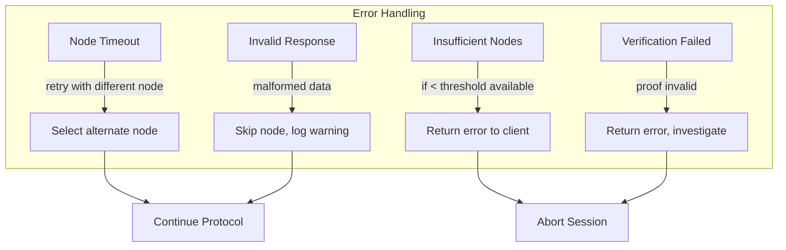

---

## Lagrange Interpolation Visualization

The key mathematical operation that enables threshold proving:

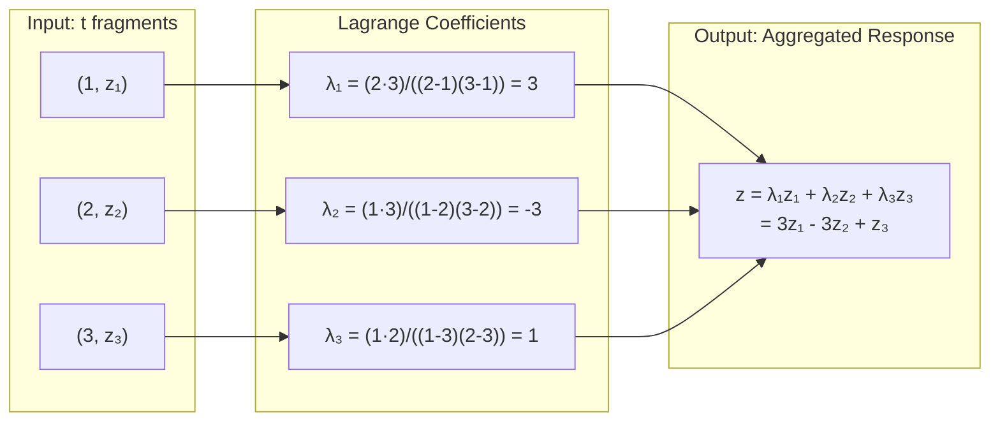

The magic: `Σλᵢsᵢ = s` (reconstructs the secret without anyone seeing it!)

---

## Security State Model

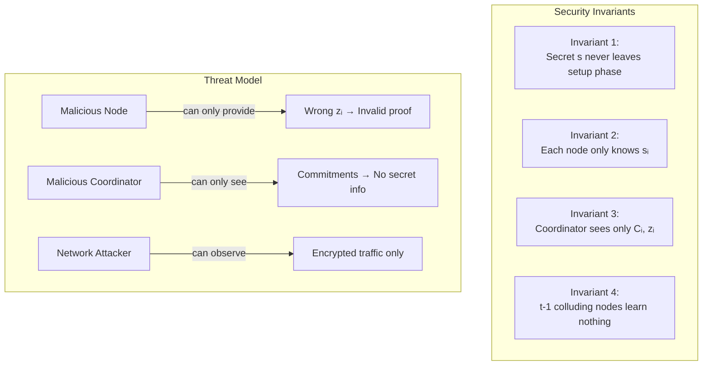

---

## Component Interaction Summary

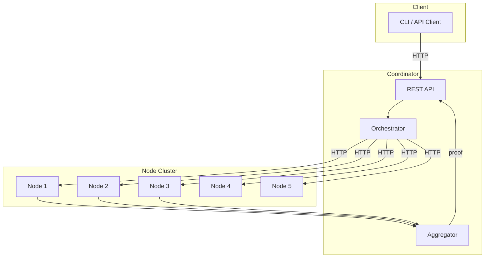